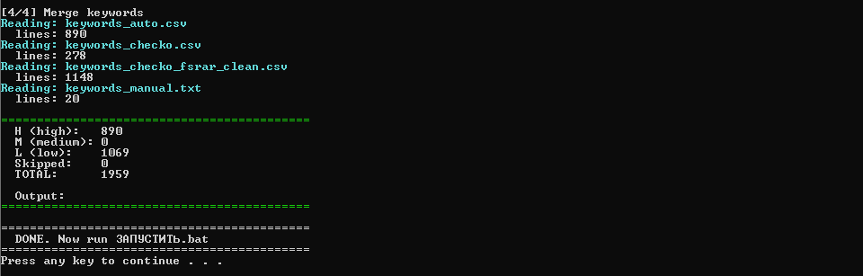
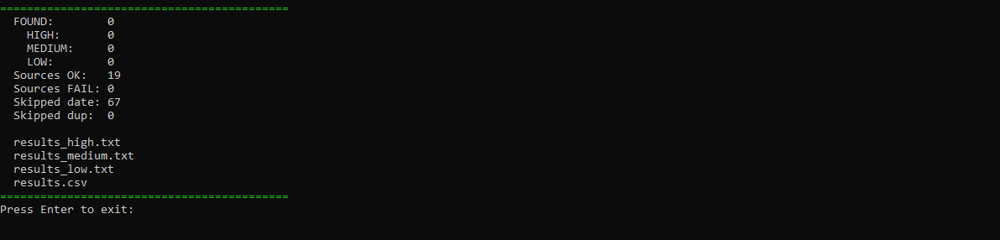
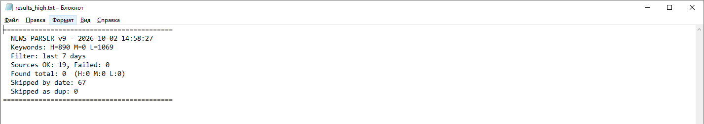

# Company News Monitor

> PowerShell-based OSINT system for monitoring mentions of companies, their executives, and business addresses across Russian news sources.

[](https://microsoft.com/powershell)
[](https://microsoft.com/windows)
[](LICENSE)
[]()
[](https://github.com/IlfatKhairutdinov/company-news-monitor/actions/workflows/powershell-check.yml)

---

## The Problem

Manually tracking news mentions of a portfolio of 300+ companies across **federal** and **regional** Russian media is impossible. Google Alerts misses regional outlets (many of them don't have RSS at all), and commercial monitoring services charge per query.

This project solves it with a **fully local, zero-cost pipeline** built on open data and free APIs.

## What It Does

1. **Builds a keyword base** automatically from a list of companies (name + INN):
   - Fetches company data via [DaData API](https://dadata.ru/) — directors, addresses, OKVED
   - Mines [FSRAR Open Data](https://fsrar.gov.ru/opendata) — government alcohol/tobacco licensing registry (10 GB XML, 1.7M records)
   - Finds related companies by shared directors and addresses
   - Extracts clean company names without legal-form prefixes (ООО, АО, ПАО...)

2. **Monitors 41 news sources** — 19 federal RSS (TASS, Kommersant, Vedomosti, RBC), 12 regional BezFormata subdomains, 10 industry feeds (Retail.ru, New Retail, МК categories, URBC)

3. **Matches with compiled regex** — 2500+ keywords in a single pass, ~50× faster than naive loops

4. **Outputs three filtered reports** by priority:
   - `results_high.txt` — companies, executives
   - `results_medium.txt` — regions, industry
   - `results_low.txt` — general context

## Key Features

| Feature | Details |
|---|---|
| **Multi-source enrichment** | DaData API + FSRAR Open Data + cross-referencing |
| **Clean keyword extraction** | Strips ООО/АО/ПАО prefixes — matches how journalists actually write names |
| **Streaming XML parser** | Reads 10 GB FSRAR dump with 8 MB chunks — no OOM, 1.67M records in 14 min |
| **Priority-based filtering** | H/M/L classification keeps signal-to-noise ratio high |
| **Regex compilation** | Single compiled pattern for 2500+ keywords, ~40× faster than naive loops |
| **Word boundaries** | Short keywords (< 8 chars) match only as whole words — no false positives |
| **Stop-list filter** | Excludes generic words (РЕГИОН, ПРЕМЬЕР, ИНВЕСТ, СТАНДАРТ...) |
| **Address normalization** | Handles Russian street variations (`ул.` vs `УЛИЦА`, `ё → е`) |
| **URL cache** | Each article shown only once across runs |
| **UTF-8 safe** | Full Cyrillic support in scripts, configs, outputs |
| **Zero install** | Runs on any corporate Windows with PowerShell 5.1 — no admin rights |

## Architecture

```text
┌──────────────────┐    ┌──────────────────┐    ┌──────────────────┐
│ counterparties   │    │  DaData API      │    │  FSRAR Open      │
│ (xlsx: name+INN) │───▶│  enrich.ps1      │───▶│  Data (10 GB XML)│
└──────────────────┘    └──────────────────┘    └──────────────────┘
         │                       │                       │
         │                       ▼                       ▼
         │              ┌──────────────────┐    ┌──────────────────┐
         │              │ keywords_auto    │    │ keywords_fsrar   │
         │              │ (~870 H)         │    │ (~1150 L)        │
         │              └──────────────────┘    └──────────────────┘
         │                       │                       │
         ▼                       ▼                       ▼
┌──────────────────────────────────────────────────────────────────┐
│           expand_keywords.ps1 → clean names (~350 new H)         │
└──────────────────────────────────────────────────────────────────┘
                                 │
                                 ▼
┌──────────────────────────────────────────────────────────────────┐
│             MERGE  →  keywords_all.csv  (~2200 keywords)         │
└──────────────────────────────────────────────────────────────────┘
                                 │
                                 ▼
                    ┌────────────────────────┐
                    │  parser.ps1 (v9)       │
                    │  41 sources:           │
                    │   19 federal RSS       │
                    │   12 BezFormata HTML   │
                    │   10 industry feeds    │
                    │  Compiled regex match  │
                    │  URL cache             │
                    └────────────────────────┘
                                 │
                ┌────────────────┼────────────────┐
                ▼                ▼                ▼
        results_high.txt  results_medium.txt  results_low.txt
```

## Documentation

- **[User Guide](docs/USER_GUIDE.md)** — пошаговое руководство по всем трём режимам
- **[Architecture](docs/ARCHITECTURE.md)** — технические детали (streaming XML, regex, нормализация адресов)

## Tech Stack

- **PowerShell 5.1** — core scripting
- **DaData API** — company enrichment (free tier: 10K req/day)
- **FSRAR Open Data** — government licensing registry (XML, 1.7M rows)
- **Selenium WebDriver** — browser automation for dynamic pages
- **Excel COM** — reading source spreadsheets
- **StreamReader + Regex** — streaming XML parsing of 10 GB dumps
- **Compiled `System.Text.RegularExpressions.Regex`** — pattern matching at C-level speed

## Getting Started

### Prerequisites

- Windows 10/11
- PowerShell 5.1 (built-in)
- Microsoft Excel (for source `.xlsx`)
- [DaData API key](https://dadata.ru/api/) (free)
- Chrome + ChromeDriver (only for `ОБНОВИТЬ_ФСРАР.bat`)

### Installation

1. Clone the repository:
   ```powershell
   git clone https://github.com/IlfatKhairutdinov/company-news-monitor.git
   cd company-news-monitor
   ```

2. Create `_bin\secrets.ps1`:
   ```powershell
   $dadataKey = "YOUR_DADATA_API_KEY_HERE"
   ```

3. Prepare `_config\counterparties.xlsx` with two columns: `Наименование`, `ИНН`.

4. (Optional) Configure keywords in `_config\keywords_manual.txt`.

### Usage

```powershell
# First run: build keyword base (5–10 min)
.\НАСТРОЙКА.bat

# Daily: parse news and write reports
.\ЗАПУСТИТЬ.bat

# Monthly: refresh FSRAR open data (20–30 min)
.\ОБНОВИТЬ_ФСРАР.bat
```

After running, check `_results\results_high.txt` for matches.

## Example Output

```text
===========================================
Source:    Kommersant (news)
Title:     РБК: Герхард Шредер приехал в Москву
Link:      https://www.kommersant.ru/doc/9008147
Date:      2026-10-07 14:00
Priority:  H
Matched:   [H] ГИПЕРГЛОБУС
===========================================
```

## Project Structure

```text
.
├── README.md
├── LICENSE
├── .gitignore
├── ЗАПУСТИТЬ.bat              # daily runner
├── НАСТРОЙКА.bat              # rebuild keyword base
├── ОБНОВИТЬ_ФСРАР.bat         # refresh FSRAR data
├── _bin/                       # all scripts
│   ├── paths.ps1               # centralized path config
│   ├── secrets.ps1             # API key (gitignored)
│   ├── parser.ps1              # main news parser (41 sources)
│   ├── enrich.ps1              # DaData enrichment
│   ├── enrich2.ps1             # affiliated companies
│   ├── expand_keywords.ps1     # clean company names extraction
│   ├── fsrar_parse.ps1         # streaming XML parser (10 GB)
│   └── ...
├── _config/                    # user input
│   ├── counterparties.xlsx     # company list (gitignored)
│   └── keywords_manual.txt     # manual keywords (gitignored)
├── _data/                      # intermediate data (gitignored)
├── _fsrar/                     # government data (gitignored, 11 GB)
├── _results/                   # parser output (gitignored)
└── _tech/                      # dev artifacts (gitignored)
```

## Screenshots

### Keyword base construction (`НАСТРОЙКА.bat`)

Merges keywords from DaData, FSRAR Open Data, clean-name expansion, and manual sources into a unified priority-ranked list.



### Daily news parsing (`ЗАПУСТИТЬ.bat`)

Runs 41 sources (19 federal RSS + 12 BezFormata regions + 10 industry feeds), matches with compiled regex, and writes three priority-filtered reports.



### Example report (`results_high.txt`)

High-priority matches — mentions of companies and executives.



## News Sources

### Federal RSS (19)

TASS, Kommersant (2 feeds), Vedomosti, RBC, RIA Novosti, Lenta.ru, Gazeta.ru, Interfax, RT, CNews, Российская Газета, PravdaReport, Московский Комсомолец, NEWSru.com, Life.ru, Habr IT, NN News, NNTV.

### Regional BezFormata (12)

Москва, Санкт-Петербург, Екатеринбург, Казань, Красноярск, Новосибирск, Омск, Самара, Улан-Удэ, Краснодар, Хабаровск, Нижний Новгород.

### Industry Feeds (10)

Retail.ru, New Retail, Retailer.ru, Финмаркет, Москвич Mag, МК Экономика, МК Происшествия, МК Общество, МК Спорт, МК Культура, URBC.Ru.

## Known Limitations

- **Windows-only** — uses Excel COM and `Read-Host` for interactive prompts.
- **Single-threaded** — 41 sources processed sequentially; parallelization is on the roadmap.
- **FSRAR XML is 10 GB uncompressed** — requires ~12 GB free disk space.
- **Yandex News / Google News** — Yandex requires captcha, Google blocked on corporate networks. Both disabled by default.

## Roadmap

- [ ] Parallel source processing via Runspace Pools
- [ ] AND-logic for M-priority keywords (reduce false positives from region names)
- [ ] SQLite backend for URL cache (replace plain text file)
- [ ] Docker container for portable deployment
- [ ] Web UI on top of `results.csv`
- [ ] Telegram bot notifications for high-priority matches

## License

MIT — see [LICENSE](LICENSE)

## Contact

**Ilfat Khairutdinov** — [GitHub](https://github.com/IlfatKhairutdinov)